# PixelRun
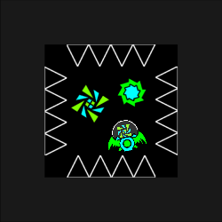\
A remake of my old game. Inspired by Geometry Dash.

# Gameplay
There are SOME gameplay mechanics you'll see in the game

# Gamemodes
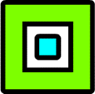\
Cube: jumps on click\
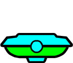\
UFO: jumps lower, but can jump in the air\
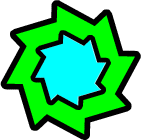\
Ball: changes gravity on click

# Portals
Portals activate on touch and apply special effect\
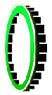\
Gravity portal: changes gravity to the opposite one.\
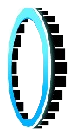\
Upside Down portal: sets your gravity to upside down mode\
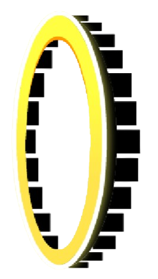\
Normal Gravity portal: sets your gravity to default\
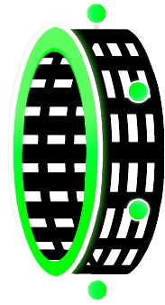\
Cube portal: sets your gamemode to cube\
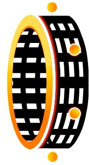\
UFO portal: sets your gamemode to UFO\
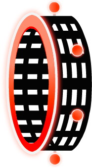\
Ball portal: sets your gamemode to ball

# Orbs
Orbs activate on click and collision with player and apply special effect\
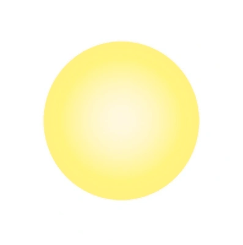\
Jump orb: allows to jump in the air\
\
Gravity orb: changes gravity

# Gameplay images
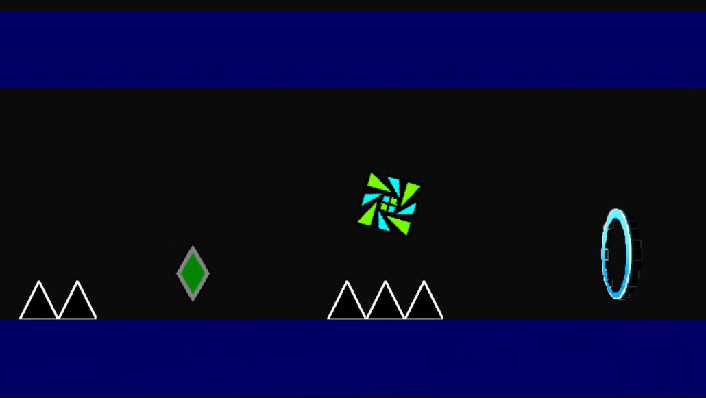
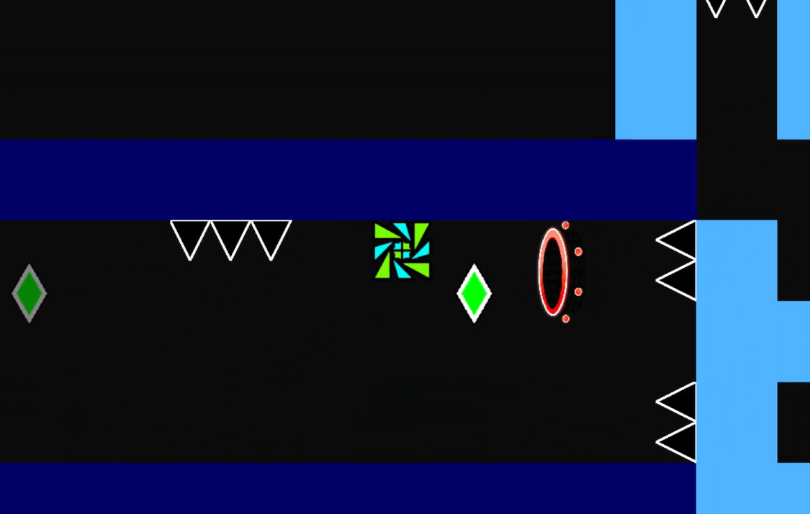
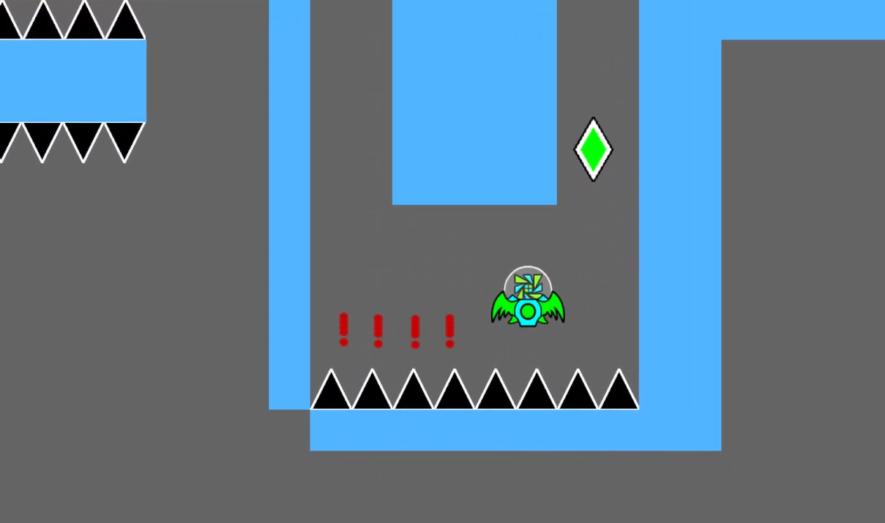
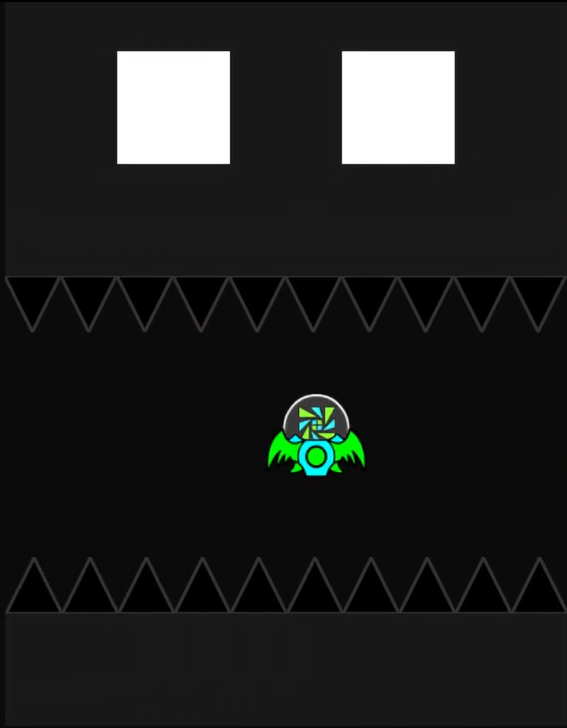
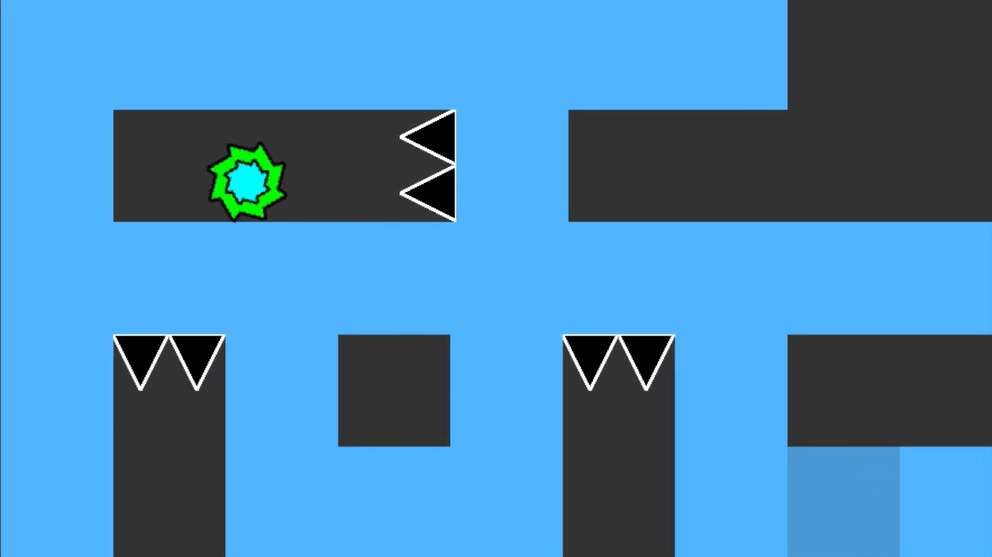
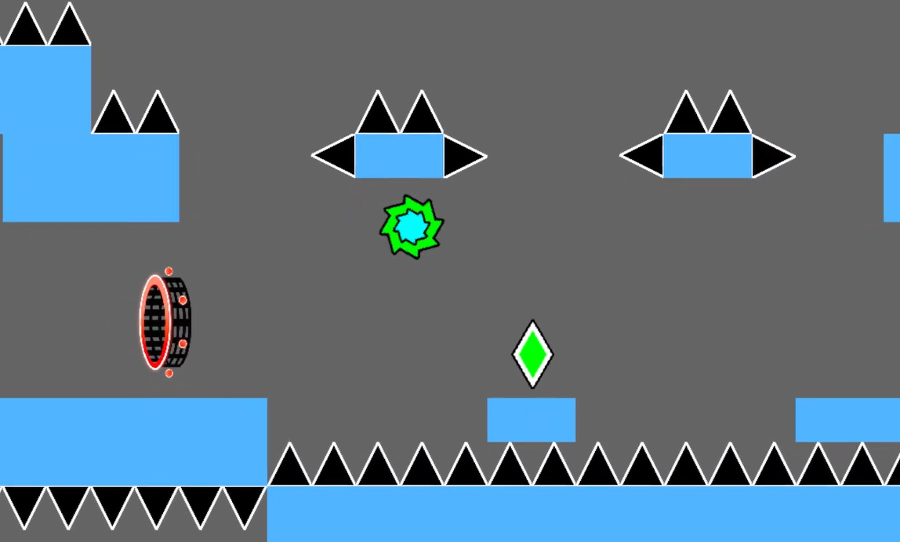

# Level Editor
By using level editor you can create your own levels and play them. Level save in JSON format.\
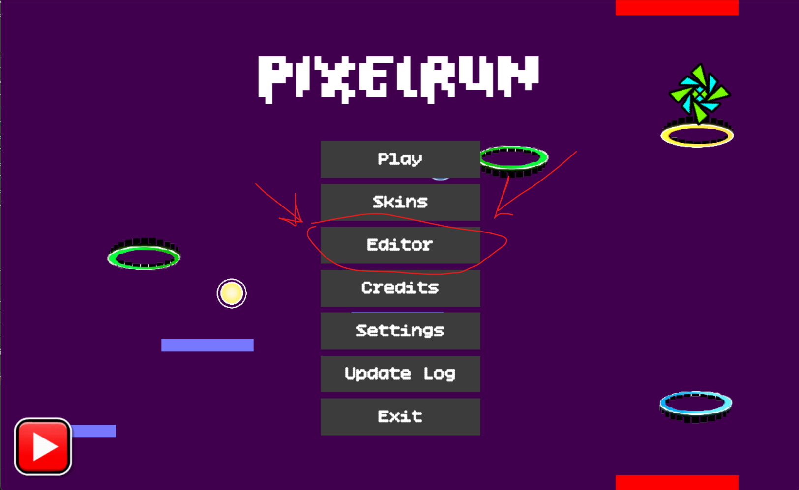
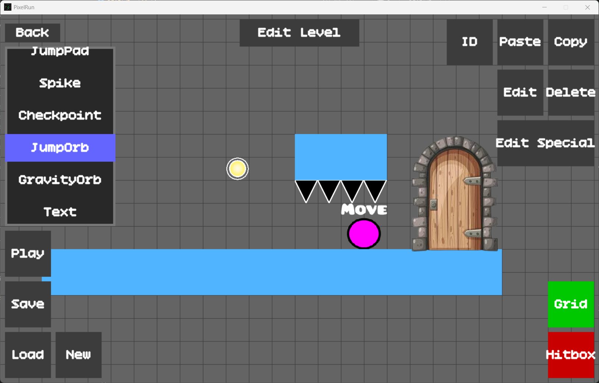

# Credits
Game by Angry Muni 

Skins textures by: RobTopGames

Portals, orbs, triggers,
checkpoint textures by RobTopGames

Background music: Me Time by Avanti

Inspired by Geometry Dash by RobTopGames

# Build command
The official build is made by using PyInstaller. Installation:\
`pip install pyinstaller`\
Command:\
`pyinstaller --onefile --noconsole --add-data "assets;assets" --icon icon_build.ico --collect-all pygame main.py`